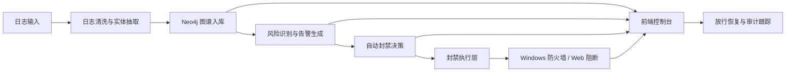

# 基于 Neo4j 的企业网络恶意行为识别与封禁系统


一个面向企业安全运营场景的日志驱动型安全系统，基于 Neo4j 构建行为关联图谱，提供告警研判、攻击链查看、自动封禁、放行恢复和监控中心等能力。

## 系统简介

系统围绕“日志接入、行为识别、图谱关联、自动处置、状态验证”五条主线展开，目标是在统一控制台中完成从风险发现到处置执行的闭环管理。

核心处理链路如下：

**日志接入 -> 实体抽取 -> 图谱入库 -> 告警生成 -> 自动封禁 -> 规则校验 -> 放行恢复**

## 核心能力

- 多源日志接入与统一清洗，支持监控目录轮询和批次状态跟踪。
- 基于 Neo4j 的安全行为图谱建模，支持事件、IP、主机、告警、封禁动作之间的关系查询。
- 告警中心、攻击链图谱、封禁管理、监控中心、规则管理、审计日志等控制台模块。
- Windows 防火墙主机级自动阻断与放行恢复。
- 前后端分离架构，支持前端控制台与后端接口联动。

## 系统架构



## 仓库结构

| 目录 | 说明 |
| --- | --- |
| `backend/` | Flask 后端接口、封禁执行、监控服务、图谱查询服务 |
| `frontend/` | Vue 3 控制台页面与接口调用层 |
| `scripts/` | 日志监控、清洗、抽取、导入、检测相关脚本 |
| `neo4j/` | 图模型初始化脚本与图数据库相关资源 |
| `data/` | 日志输入、处理结果、运行态状态与批次记录 |
| `docs/` | 系统设计、数据字典和项目文档 |
| `deploy/` | 部署相关文件 |
| `tests/` | 测试资源目录 |

## 运行环境

| 组件 | 建议版本 | 说明 |
| --- | --- | --- |
| Python | 3.10+ | 后端与脚本运行环境 |
| Node.js | 18+ | 前端开发与构建环境 |
| Neo4j | 5.x | 图数据库服务 |
| PowerShell | 可用 | `REAL` 模式下执行 Windows 防火墙操作 |
| Windows | 10 / 11 | 进行 Windows 防火墙阻断验证时推荐使用 |

## 快速启动

### 1. 初始化 Neo4j

```powershell
cypher-shell -f neo4j/init_schema.cypher
```

### 2. 启动后端

```powershell
cd backend
python app.py
```

默认监听地址：

- `http://127.0.0.1:5000`

### 3. 启动前端

```powershell
cd frontend
npm install
npm run dev
```

默认访问地址：

- `http://127.0.0.1:5173`

### 4. 启动日志监控

```powershell
python scripts/log_watcher.py --interval 5
```

## 核心配置

常用配置项如下：

| 变量名 | 说明 |
| --- | --- |
| `FLASK_HOST` | 后端监听地址，默认 `0.0.0.0` |
| `FLASK_PORT` | 后端监听端口，默认 `5000` |
| `NEO4J_URI` | Neo4j 连接地址 |
| `NEO4J_USERNAME` | Neo4j 用户名 |
| `NEO4J_PASSWORD` | Neo4j 密码 |
| `NEO4J_DATABASE` | Neo4j 数据库名 |
| `BAN_ENFORCEMENT_MODE` | 封禁执行模式，可选 `REAL`、`WEB_BLOCKLIST`、`MOCK` |
| `DIRECT_HOST_BLOCK_MODE` | 是否启用监控链路中的直接封禁逻辑 |
| `DIRECT_HOST_BLOCK_MIN_RISK_SCORE` | 自动封禁风险阈值 |
| `BAN_WINDOWS_FIREWALL_RULE_PREFIX` | 防火墙规则名前缀 |
| `BAN_WINDOWS_FIREWALL_PROTOCOL` | 阻断协议，默认 `TCP` |
| `BAN_WINDOWS_FIREWALL_DIRECTION` | 阻断方向，默认 `Inbound` |
| `BAN_WINDOWS_FIREWALL_LOCAL_PORTS` | 需要重点保护的本地端口 |

示例配置：

```dotenv
FLASK_HOST=0.0.0.0
FLASK_PORT=5000
NEO4J_URI=bolt://127.0.0.1:7687
NEO4J_USERNAME=neo4j
NEO4J_PASSWORD=your_password
NEO4J_DATABASE=neo4j
BAN_ENFORCEMENT_MODE=REAL
DIRECT_HOST_BLOCK_MODE=true
DIRECT_HOST_BLOCK_MIN_RISK_SCORE=85
BAN_WINDOWS_FIREWALL_RULE_PREFIX=ESG
BAN_WINDOWS_FIREWALL_PROTOCOL=TCP
BAN_WINDOWS_FIREWALL_DIRECTION=Inbound
BAN_WINDOWS_FIREWALL_LOCAL_PORTS=8080
```

## 模块说明

### 后端模块

| 模块 | 说明 |
| --- | --- |
| `app/api/` | 对外提供图谱、告警、封禁、监控和鉴权接口 |
| `app/services/ban_service.py` | 封禁、放行、状态编排与动作记录 |
| `app/services/firewall_service.py` | Windows 防火墙规则创建、删除与校验 |
| `app/services/monitor_service.py` | 监控进程管理、批次汇总和拓扑数据组装 |
| `app/services/attack_chain_service.py` | 攻击链查询与图谱数据整理 |
| `app/services/graph_service.py` | 图谱总览与高风险对象统计 |

### 前端模块

| 页面 / 组件 | 说明 |
| --- | --- |
| `DashboardView.vue` | 工作台总览、告警态势、高风险对象统计 |
| `AlertsView.vue` | 告警列表、筛选、攻击链查看 |
| `BansView.vue` | 封禁状态、执行结果、放行恢复 |
| `MonitorCenterView.vue` | 日志监控启停、批次记录、监控流程图 |
| `AuditLogView.vue` | 审计日志查询与责任追踪 |
| `UserManageView.vue` | 用户治理与角色边界查看 |
| `RuleManageView.vue` | 规则清单与变更事项管理 |
| `AttackChainGraph.vue` | 攻击链图谱展示与节点详情联动 |
| `StatCard.vue` | 总览指标卡片 |

## 界面说明

系统前端控制台以白色企业后台风格为主，核心页面职责如下：

- 工作台：展示图谱规模、告警态势和高风险对象排行。
- 告警中心：提供告警列表、等级信息、事件类型和攻击链入口。
- 封禁管理：查看封禁状态、执行结果、校验状态和放行操作。
- 日志监控中心：统一管理监控任务、查看最近处理记录和监控流程图。
- 攻击链图谱：展示攻击源、安全事件、目标资源、告警和处置动作之间的关系。
- 规则管理、用户管理、审计日志：承接治理、审批和责任追踪能力。

## 验证方式

### 功能联通验证

1. 启动 Neo4j、后端、前端和日志监控脚本。
2. 登录前端控制台，确认工作台、告警、封禁和监控页面可正常访问。
3. 将测试日志放入 `data/incoming/` 或 `data/incoming/unified/`。
4. 在监控中心查看批次处理状态、自动封禁对象和流程图节点变化。
5. 在封禁管理页确认封禁状态、执行结果和校验结果。

### 真实阻断验证

在 `BAN_ENFORCEMENT_MODE=REAL` 的情况下，可以通过以下方式确认阻断已生效：

1. 页面出现已封禁状态、执行成功状态和校验成功状态。
2. PowerShell 中可查询到对应防火墙规则。
3. 被保护服务在封禁后无法继续访问。
4. 执行放行后，规则被删除且访问恢复。

防火墙规则查询示例：

```powershell
Get-NetFirewallRule | Where-Object { $_.DisplayName -like "ESG-BAN-*" }
```

## 常见问题

### 1. 前端页面打开但没有数据

- 确认后端已运行在 `127.0.0.1:5000`。
- 确认 Neo4j 服务可连接。
- 确认 `frontend/src/api/http.js` 指向的后端地址可访问。

### 2. 页面出现封禁记录但没有真实阻断

- 检查 `BAN_ENFORCEMENT_MODE` 是否为 `REAL`。
- 检查当前环境是否为 Windows。
- 检查 PowerShell 是否具备执行防火墙命令所需权限。
- 检查 `BAN_WINDOWS_FIREWALL_LOCAL_PORTS` 是否与受保护服务端口一致。

### 3. 监控脚本没有处理新日志

- 确认日志已写入 `data/incoming/` 或 `data/incoming/unified/`。
- 确认日志格式能够被现有适配器识别。
- 确认监控脚本正在运行且轮询间隔配置正确。

## 相关文档

- [当前状态说明](docs/current_status.md)
- [数据字典](docs/data_dictionary.md)
- [系统设计说明](docs)

## 许可证

当前仓库未单独声明开源许可证。如需用于外部发布，请先补充许可证与发布规范。
