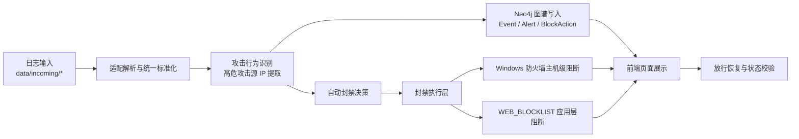
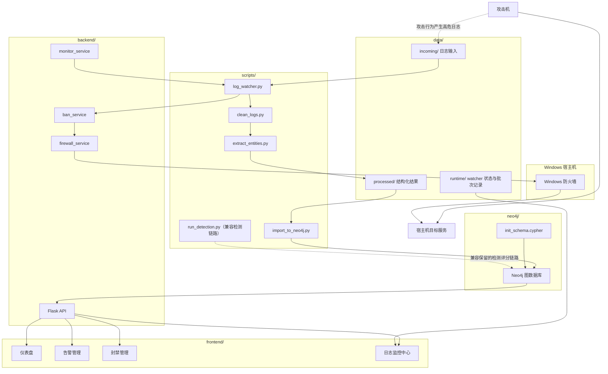
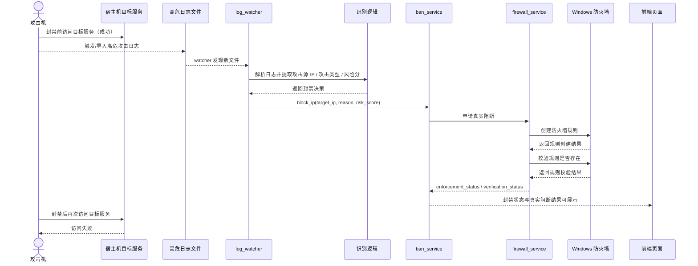
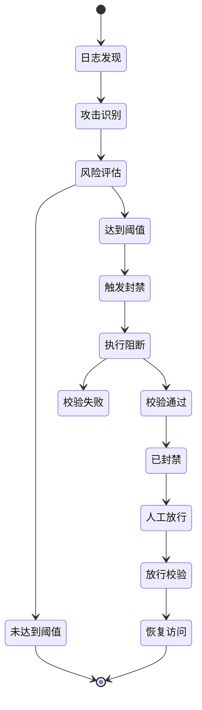
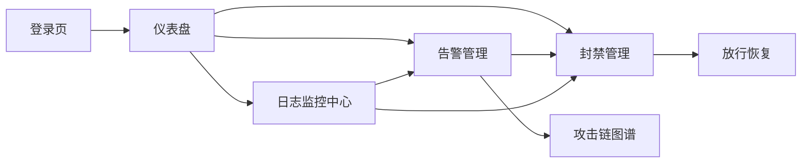
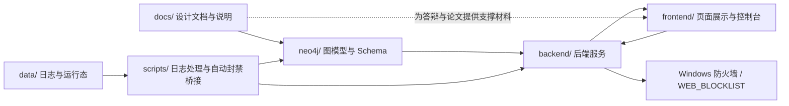

# 基于 Neo4j 的企业网络恶意行为识别与封禁系统


> 一句话简介：一个以日志驱动为核心、以 Neo4j 图谱为支撑、以自动主机级真实封禁为亮点的企业安全工程原型。
>
> 当前版本定位：可运行工程版本，已完成自动识别、自动触发、Windows 防火墙主机级真实阻断、放行恢复和页面展示闭环，适合 GitHub 首页展示、毕业设计演示、答辩说明和复现实验。

## 当前版本状态速览

| 项目项 | 当前状态 | 说明 |
| --- | --- | --- |
| 当前版本 | 可运行 | 已具备真实工程目录与完整主线 |
| 日志接入 | 已完成 | 支持多源目录和统一入口 `data/incoming/unified/` |
| 攻击识别 | 已完成 | 当前主线覆盖 SQL 注入、命令注入、暴力破解、横向移动 |
| 自动封禁 | 已完成 | 能基于日志识别结果自动触发封禁动作 |
| 真实阻断 | 已验证 | 已完成 Windows 防火墙主机级真实封禁验证链路 |
| 放行恢复 | 已完成 | 支持放行、规则删除与访问恢复 |
| 页面展示 | 已完成 | 已有仪表盘、告警管理、封禁管理、日志监控中心、攻击链展示 |
| 项目定位 | 毕设可演示 | 适合答辩、论文撰写、仓库公开展示与实验复现 |

<a id="quick-nav"></a>

## 快速导航

- [项目亮点](#project-highlights)
- [系统总体架构图](#architecture-diagrams)
- [自动封禁调用链时序图](#auto-block-sequence)
- [项目启动方式](#quick-start)
- [演示流程与答辩顺序](#demo-guide)
- [如何验证自动封禁是否真的生效](#verify-guide)
- [项目目录结构说明](#project-structure)
- [FAQ / 常见问题](#faq)
- [界面预览 / 截图占位说明](#screenshots)

## 1. 项目简介

本项目是毕业设计《基于 Neo4j 的企业网络恶意行为识别与封禁系统的设计与实现》的工程实现仓库。

它不是一个只做日志收集与展示的普通日志平台，而是一个**基于日志驱动的恶意行为识别与自动封禁系统**。项目的核心价值不在于单纯产出中间 CSV、告警列表或图谱节点，而在于把“识别结果”进一步转化为“自动处置动作”，形成从日志输入到真实阻断、再到放行恢复的闭环。

当前仓库已经不是“只有需求分析和建模文档”的阶段，而是已经包含真实工程代码和可运行链路，主要包括：

- `backend/`：Flask 后端接口与封禁执行逻辑
- `frontend/`：Vue3 前端控制台页面
- `scripts/`：日志接入、清洗、抽取、导入、识别、监控脚本
- `neo4j/`：图数据库 Schema 与导入相关 Cypher
- `data/`：日志输入、处理结果、运行态状态、归档与失败样例
- `docs/`：系统设计、图模型、数据字典、当前进度说明

当前版本的重点主线是：

**日志输入 -> 识别攻击源 IP 与高危攻击行为 -> 自动触发封禁 -> 调用 Windows 防火墙执行主机级阻断 -> 页面展示封禁结果 -> 放行后恢复访问**

## 2. 项目背景与研究意义

在企业网络安全场景中，单纯依赖人工查看日志和手工封禁往往存在以下问题：

1. 日志来源分散，难以在短时间内还原攻击上下文。
2. 告警发现之后，如果仍然依赖人工处置，攻击者可能已经继续横向移动或持续探测。
3. 传统“只看日志”的系统通常停留在发现和展示层，缺乏自动响应能力。

本项目的研究意义在于：

1. 利用 Neo4j 将用户、主机、IP、会话、事件、告警、封禁动作组织成安全行为图谱，增强安全事件之间的关联表达能力。
2. 基于日志识别高危攻击行为，并将检测结果转化为自动封禁动作，而不是停留在“只生成告警”。
3. 通过真实的 Windows 防火墙主机级阻断链路，验证“检测后自动阻断攻击者”的工程可行性。
4. 为毕业论文撰写和答辩演示提供一套既能讲清设计思路、又能展示真实效果的工程化样例。

## 3. 项目目标

本项目当前围绕以下目标进行设计和实现：

1. 构建企业网络安全行为图谱。
2. 基于日志识别恶意行为与高风险攻击源。
3. 提供告警展示、攻击关系追踪和风险对象分析能力。
4. 将识别结果联动为自动封禁动作，并保留审计痕迹。
5. 验证 Windows 防火墙主机级自动封禁和放行恢复的真实闭环。
6. 形成适合毕业设计答辩展示与论文撰写的工程化项目仓库。

## 4. 当前项目状态说明

当前项目已经具备真实工程结构和核心业务链路，不再是“仅做建模文档”的状态。

目前已经落地的内容包括：

1. Flask 后端接口工程。
2. Vue3 前端页面工程。
3. 多源日志接入与统一入口监测脚本。
4. Neo4j 图谱建模与导入脚本。
5. 告警、攻击链、封禁管理、监控中心等页面展示能力。
6. 自动封禁、放行恢复、执行校验与审计记录能力。
7. Windows 防火墙主机级自动封禁验证链路。

详细进度说明可参考 [docs/current_status.md](docs/current_status.md)。

<a id="project-highlights"></a>

## 5. 项目亮点

### 5.1 当前版本的核心亮点

1. **Neo4j 图谱支撑攻击关系表达**：用户、主机、IP、会话、事件、告警、封禁动作可以关联展示，而不是孤立日志条目。
2. **日志驱动自动封禁**：日志不是只用于展示，而是直接参与识别、决策和动作触发。
3. **Windows 防火墙主机级真实阻断**：当前版本已经不是“只记一条封禁记录”，而是能真实创建阻断规则。
4. **放行恢复闭环**：不是只会封禁，还能删除规则、恢复访问并保留动作历史。
5. **页面展示与监控联动**：监控中心、封禁管理、告警管理和攻击链展示可以形成答辩闭环。
6. **适合毕业设计答辩**：既有设计文档，也有工程实现，还有真实可验证的效果链路。

### 5.2 当前版本为什么适合 GitHub 首页展示

1. 能快速说明项目是做什么的。
2. 能明确当前做到什么程度。
3. 能看清系统主线和真实亮点。
4. 能直接给出启动、演示和验证方式。
5. 能真实说明当前边界，不夸大未完成能力。

## 6. 系统总体设计思路

当前版本采用“**动作导向**”的系统设计，而不是“中间数据产物导向”的设计。

这意味着：

1. 日志的核心作用是触发识别与处置动作，而不是为了堆积大量中间处理文件。
2. Neo4j 图谱的核心作用是承载攻击关系、风险对象与处置结果，而不是只做静态展示。
3. 当前版本优先完成“主机级自动封禁”的真实闭环，先解决“识别后能不能真的挡住攻击者”这个关键问题。
4. 更细粒度的网站级、路径级、服务级阻断可以作为后续增强方向，但不是当前版本的主目标。



<a id="architecture-diagrams"></a>

## 7. 系统总体架构图

下图展示当前项目的真实工程结构与运行关系。图中重点突出当前仓库已经存在的目录、组件和主机级真实封禁执行链路。



### 7.1 架构图阅读说明

1. `scripts/log_watcher.py` 是当前推荐演示主线的关键触发入口。
2. Neo4j 主要承载图谱、告警、封禁动作和审计状态。
3. `ban_service + firewall_service` 是当前“自动触发 -> 真实阻断”的核心实现链。
4. 前端页面主要负责展示状态、查看攻击链、执行放行与复核，而不是负责封禁逻辑本身。

## 8. 当前版本核心功能

| 功能模块 | 当前状态 | 说明 |
| --- | --- | --- |
| 日志输入能力 | 已完成 | 支持 `data/incoming/` 多目录输入，也支持 `data/incoming/unified/` 统一入口 |
| 攻击识别能力 | 已完成 | 可识别高危攻击源 IP 与高危行为，当前主线覆盖 SQL 注入、命令注入、暴力破解、横向移动 |
| 图谱入库能力 | 已完成 | 支持将用户、主机、IP、会话、事件、告警、封禁动作导入 Neo4j |
| 自动封禁能力 | 已完成 | watcher 可触发自动封禁，后端会记录当前状态、历史动作、执行结果与校验结果 |
| 页面展示能力 | 已完成 | 已有仪表盘、告警管理、封禁管理、日志监控中心、攻击链展示页面 |
| 放行恢复能力 | 已完成 | 支持已封禁 -> 放行，已放行 -> 重新封禁，并校验规则是否移除或恢复 |
| 真实阻断验证链路 | 已完成 | 已具备 Windows 防火墙主机级自动封禁链路验证能力 |
| 应用层阻断备用链路 | 已完成 | 支持 `WEB_BLOCKLIST` 模式，作为不具备管理员权限时的最小真实阻断方案 |

## 9. 系统运行主线

当前版本的真实运行主线如下：

1. 将高危测试日志放入 `data/incoming/` 或 `data/incoming/unified/`。
2. `scripts/log_watcher.py` 发现新文件并选择适配器解析。
3. 系统识别攻击源 IP、攻击类型、事件数量和风险分值。
4. 当攻击行为达到自动封禁条件后，调用后端 `ban_service.block_ip(...)`。
5. 后端写入或更新 `BlockAction`、`IP` 等状态信息，并生成审计历史。
6. 根据当前执行模式，调用真实执行层。
7. 在 `REAL` 模式下，系统使用 Windows 防火墙为攻击源 IP 下发主机级阻断规则。
8. 前端封禁管理页、监控中心页展示封禁结果、校验状态和真实阻断情况。
9. 管理员执行放行后，系统删除对应规则并恢复访问。

主线可简化记忆为：

**日志输入 -> 识别攻击源 -> 自动触发封禁 -> Windows 防火墙主机级阻断 -> 页面展示 -> 放行恢复**

<a id="auto-block-sequence"></a>

## 10. 自动封禁调用链时序图

下面的时序图专门展示“从日志到自动封禁”的当前推荐演示调用过程。



## 11. 自动封禁实现原理

### 11.1 当前版本的封禁策略

当前版本采用的是**统一主机级自动封禁策略**。

其核心思路是：

1. 当日志中识别到高危攻击行为后，系统会将攻击源 IP 视为对当前宿主机存在持续威胁。
2. 系统不会只在前端上做“已封禁”标记，也不会只在 Neo4j 中写一条处置记录。
3. 系统会把该攻击源 IP 进一步送入实际执行层，尝试对该 IP 做真实阻断。

当前自动封禁触发条件主要由以下因素决定：

1. 攻击类型是否属于高危行为。
2. 风险分是否达到自动封禁阈值。
3. 对暴力破解场景，还会结合事件次数决定是否触发自动封禁。

当前代码中的主机级自动封禁最低风险分默认值为 `85`，配置项为 `DIRECT_HOST_BLOCK_MIN_RISK_SCORE`。

### 11.2 当前主线中的自动封禁调用链

当前推荐演示主线中，自动封禁主要由 `scripts/log_watcher.py` 的简化主机级自动封禁模式触发：

1. watcher 原地读取日志文件。
2. 识别 `src_ip`、攻击类型和是否达到封禁条件。
3. 生成自动封禁决策后，直接调用后端 `ban_service.block_ip(...)`。
4. `ban_service` 写入或更新当前 IP 的封禁状态、动作历史和执行信息。
5. `ban_service` 再根据配置，调用执行后端进行真实封禁。

### 11.3 自动封禁状态流转图



## 12. Windows 防火墙主机级阻断机制说明

当前项目的真实主机级阻断依赖 `backend/app/services/firewall_service.py`。

当 `BAN_ENFORCEMENT_MODE=REAL` 时：

1. 系统会调用 PowerShell。
2. 通过 Windows `NetSecurity` 模块执行 `New-NetFirewallRule` 创建阻断规则。
3. 通过 `Get-NetFirewallRule`、`Get-NetFirewallAddressFilter`、`Get-NetFirewallPortFilter` 校验规则是否存在。
4. 通过 `Remove-NetFirewallRule` 删除规则，实现放行恢复。

当前实现有以下特点：

1. **默认命名前缀明确**：防火墙规则名前缀默认是 `ESG`，便于检索、排查和清理。
2. **支持按源 IP 阻断**：可直接针对攻击源 IP 创建入站阻断规则。
3. **支持按本地端口细化**：如果设置 `BAN_WINDOWS_FIREWALL_LOCAL_PORTS`，则可只阻断指定服务端口。
4. **支持阻断校验**：阻断后不是盲目认为成功，而是继续查询规则是否真实存在。
5. **适合答辩演示**：可以用系统页面、PowerShell 查询和攻击机访问失败三种方式共同证明规则确实生效。

推荐理解为：

- 如果 `BAN_WINDOWS_FIREWALL_LOCAL_PORTS` 为空，表示按攻击源 IP 阻断进入本机的入站访问。
- 如果 `BAN_WINDOWS_FIREWALL_LOCAL_PORTS=80,8080` 之类，表示只阻断该攻击源 IP 对这些本地端口的访问。

这正是当前版本“主机级自动封禁”的核心落地点。

## 13. 为什么当前版本的封禁属于“真实封禁”

这一节是当前 README 需要重点强调的亮点。

### 13.1 不是只告警

当前项目不是“检测完就结束”，而是会继续把识别结果转化成封禁动作。

### 13.2 不是只记一条封禁记录

当前项目不是仅仅把一条 `BlockAction` 写进 Neo4j，也不是仅仅在页面表格里把状态改成 `BLOCKED`。

### 13.3 当前版本的“真实封禁”判断标准

| 判断项 | 逻辑封禁 | 当前项目主线 |
| --- | --- | --- |
| 前端显示已封禁 | 可能有 | 有 |
| Neo4j 中存在处置记录 | 可能有 | 有 |
| 宿主机上存在真实阻断规则 | 不一定 | 有，`REAL` 模式下可验证 |
| 攻击机后续访问会失败 | 不一定 | 是，本项目主线要求出现访问失败 |
| 放行后能恢复访问 | 不一定 | 是 |

### 13.4 为什么当前版本可以证明不是逻辑封禁

当前版本可以用下面四个动作共同证明“这不是逻辑封禁”：

1. 攻击前，目标服务可访问。
2. 日志触发自动封禁后，Windows 防火墙规则真实生成。
3. 攻击机再次访问目标服务失败。
4. 放行后，规则删除，访问恢复。

这四步同时成立，才能说明当前版本完成的是**真实自动封禁闭环**。

## 14. 真实封禁验证链路图


## 15. 放行恢复机制说明

当前版本已经具备真实放行恢复能力。

当管理员在封禁管理页执行放行，或后端调用放行逻辑时，系统会：

1. 将当前封禁状态从 `BLOCKED` 切换为 `RELEASED`。
2. 记录新的放行动作，补充历史审计信息。
3. 调用真实执行层删除 Windows 防火墙规则，或移除应用层 blocklist 记录。
4. 再次执行校验，确认规则已经不存在。
5. 将放行结果回写到页面展示层。

因此，当前版本的恢复链路不是“把页面状态改回去”，而是真实尝试解除阻断并进行验证。

## 16. 页面功能关系与展示说明

### 16.1 当前页面功能关系图



### 16.2 页面职责概览

| 页面 | 主要作用 | 当前演示主线中的角色 |
| --- | --- | --- |
| 仪表盘 | 展示图谱总览、高风险对象、总体态势 | 适合答辩开场展示系统整体完成度 |
| 告警管理 | 展示告警列表、查看攻击链 | 说明识别结果如何与图谱关联 |
| 封禁管理 | 展示当前封禁状态、真实执行结果、放行恢复 | 当前“真实封禁”亮点页面 |
| 日志监控中心 | 展示 watcher 状态、最近处理记录、自动封禁结果 | 当前“日志驱动自动封禁”主线页面 |
| 攻击链图谱 | 展示单条告警背后的关系链路 | 说明 Neo4j 在当前项目中的价值 |

## 17. 项目目录结构说明

<a id="project-structure"></a>

当前仓库的主要工程结构如下：

```text
enterprise-security-graph/
|-- backend/                         # Flask 后端工程
|   |-- app/
|   |   |-- api/                     # RESTful API 蓝图
|   |   |-- core/                    # 统一响应与异常
|   |   |-- data/                    # blocklist 等运行态数据文件
|   |   |-- db/                      # Neo4j 驱动封装
|   |   |-- middleware/              # 请求拦截中间件
|   |   `-- services/                # 图谱、检测、封禁、监控等服务
|   |-- app.py                       # 后端启动入口
|   |-- config.py                    # 后端配置
|   `-- requirements.txt             # Python 依赖
|-- data/                            # 日志输入、处理结果、运行状态、归档与失败样例
|   |-- incoming/                    # 原始日志输入目录
|   |-- processed/                   # 清洗与抽取后的结构化结果
|   |-- archive/                     # 成功处理后的归档日志
|   |-- failed/                      # 处理失败日志及错误原因
|   |-- runtime/                     # watcher 状态、批次状态、运行日志
|   `-- raw/                         # 原始样例数据目录
|-- deploy/                          # 部署与启动说明预留目录
|-- docs/                            # 设计文档、图模型、数据字典、当前进度说明
|-- frontend/                        # Vue3 前端工程
|   |-- src/
|   |   |-- api/                     # 前端接口调用封装
|   |   |-- components/              # 公共组件
|   |   |-- layouts/                 # 页面布局
|   |   |-- router/                  # 路由
|   |   |-- styles/                  # 全局样式
|   |   `-- views/                   # 仪表盘、告警、封禁、监控中心等页面
|   |-- package.json                 # Node 依赖与脚本
|   `-- vite.config.js               # Vite 配置
|-- neo4j/                           # Neo4j Schema 与导入相关 Cypher
|   |-- init_schema.cypher
|   `-- import_data.cypher
|-- scripts/                         # 日志监测、清洗、抽取、导入、识别、自动封禁桥接脚本
|   |-- adapters/                    # 多源日志适配器
|   |-- log_watcher.py               # 监控主入口
|   |-- clean_logs.py                # 日志清洗
|   |-- extract_entities.py          # 实体与关系抽取
|   |-- import_to_neo4j.py           # 导入 Neo4j
|   `-- run_detection.py             # 检测与评分
|-- tests/                           # 测试目录预留
|-- AGENTS.md                        # 协作约束说明
`-- README.md                        # 项目首页说明
```

### 17.1 `data/` 目录职责细分

| 目录 | 作用 |
| --- | --- |
| `data/incoming/` | 原始日志输入目录，当前包含 `unified`、`safeline_waf`、`n9e_waf`、`windows_firewall`、`linux_firewall` 等入口 |
| `data/processed/` | 清洗后的节点 CSV、关系 CSV，以及中间结构化结果 |
| `data/archive/` | 已成功处理的日志归档 |
| `data/failed/` | 处理失败日志及错误原因 |
| `data/runtime/` | watcher 运行状态、批次状态、监控日志等运行态文件 |
| `data/raw/` | 原始样例日志与原始数据目录 |

### 17.2 当前主运行链路中的核心目录

如果从“日志输入 -> 自动主机级封禁 -> 页面展示 -> 放行恢复”这条主线理解项目，最关键的目录是：

1. `data/incoming/`
2. `scripts/`
3. `backend/`
4. `frontend/`
5. `neo4j/`
6. `data/runtime/`

## 18. 模块关系图

下图更强调目录与模块之间的关系，而不是单纯列目录名。



## 19. 前后端与脚本模块说明

### 19.1 后端模块分组说明

#### A. API 层

| 模块 | 说明 |
| --- | --- |
| `backend/app/api/graph_api.py` | 图谱总览、统计与详情查询接口 |
| `backend/app/api/alert_api.py` | 告警列表与攻击链接口 |
| `backend/app/api/ban_api.py` | 封禁管理、放行、重新封禁、规则校验接口 |
| `backend/app/api/monitor_api.py` | 日志监控启停、状态、拓扑接口 |

#### B. 业务服务层

| 模块 | 说明 |
| --- | --- |
| `graph_service.py` | 图谱总览与风险对象数据组织 |
| `detection_service.py` | 检测、评分、告警回写 |
| `ban_service.py` | 当前项目中封禁、放行、动作历史和执行状态的核心编排层 |
| `firewall_service.py` | Windows 防火墙真实执行与校验 |
| `monitor_service.py` | watcher 进程管理、批次状态汇总、监控拓扑生成 |
| `attack_chain_service.py` | 告警对应攻击链查询 |

#### C. 基础设施层

| 模块 | 说明 |
| --- | --- |
| `neo4j_client.py` | Neo4j 连接与读写封装 |
| `ip_blocklist.py` | `WEB_BLOCKLIST` 模式的应用层真实阻断 |
| `response.py / errors.py` | 统一 JSON 响应和异常处理 |

### 19.2 前端模块分组说明

#### A. 页面层

| 页面 | 作用 |
| --- | --- |
| `DashboardView.vue` | 图谱总览与高风险对象展示 |
| `AlertsView.vue` | 告警列表与攻击链查看 |
| `BansView.vue` | 封禁状态、执行结果、真实阻断、放行恢复 |
| `MonitorCenterView.vue` | 日志监控启停、最近处理记录、自动封禁结果 |
| `LoginView.vue` | 当前为页面入口与布局起点，未实现完整鉴权 |

#### B. 公共展示层

| 模块 | 作用 |
| --- | --- |
| `AttackChainGraph.vue` | 攻击链图谱展示 |
| `StatCard.vue` | 统计卡片 |
| `ChartPlaceholder.vue` | 图表占位组件 |

#### C. 路由与接口层

| 模块 | 作用 |
| --- | --- |
| `src/router/index.js` | 页面路由 |
| `src/api/` | 对后端接口的统一请求封装 |
| `src/api/http.js` | Axios 实例，默认直连 `http://127.0.0.1:5000` |

### 19.3 脚本模块按主流程 / 辅助流程分组

#### A. 当前演示主线真正会用到的脚本

| 脚本 | 作用 |
| --- | --- |
| `log_watcher.py` | 当前推荐演示主线的入口，负责发现新日志并触发后续流程 |
| `clean_logs.py` | 清洗原始日志 |
| `extract_entities.py` | 抽取实体和关系 |
| `import_to_neo4j.py` | 把结构化结果导入 Neo4j |
| `behavior_aggregator.py` | 识别高危行为、聚合攻击特征 |
| `behavior_alert_mapper.py` | 将行为结果映射成告警与封禁相关输出 |

#### B. 兼容保留 / 扩展链路中的脚本

| 脚本 | 作用 |
| --- | --- |
| `run_detection.py` | 执行图谱检测与评分，适合兼容保留检测链或后续扩展 |
| `log_classifier.py` | 统一入口日志分类 |
| `event_normalizer.py` | 统一事件标准化 |
| `scripts/adapters/` | 多源日志适配器，保证既有目录兼容可用 |

### 19.4 当前演示主线最关键的模块

如果只看当前答辩主线，最核心的模块是：

1. `scripts/log_watcher.py`
2. `backend/app/services/ban_service.py`
3. `backend/app/services/firewall_service.py`
4. `frontend/src/views/MonitorCenterView.vue`
5. `frontend/src/views/BansView.vue`

## 20. 当前版本的运行环境要求

推荐运行环境如下：

| 组件 | 建议版本 / 条件 | 说明 |
| --- | --- | --- |
| 操作系统 | Windows 10 / 11 | 若要验证 Windows 防火墙真实封禁，必须是 Windows 宿主机 |
| Python | 3.10 及以上 | 后端与脚本均基于 Python 运行 |
| Node.js | 18 及以上 | 前端基于 Vite + Vue3 |
| Neo4j | 5.x | 当前 schema 与导入脚本优先按 Neo4j 5.x 编写 |
| PowerShell | 可用 | `REAL` 模式通过 PowerShell 调用 Windows 防火墙 |
| 管理员权限 | 建议具备 | Windows 防火墙真实规则创建与删除通常需要管理员权限 |

后端当前主要依赖：

- `Flask`
- `flask-cors`
- `neo4j`

前端当前主要依赖：

- `Vue3`
- `Element Plus`
- `ECharts`
- `Axios`
- `Vue Router`
- `Vite`

## 21. 项目启动方式

<a id="quick-start"></a>

### 21.1 启动前准备

1. 启动本机 Neo4j 服务。
2. 为后端和脚本准备 Neo4j 连接参数。
3. 如果要验证 Windows 防火墙真实封禁，请使用管理员权限打开相关终端。
4. 准备一个宿主机上的目标服务用于被保护，例如本地 Web 服务、实验靶场或其他测试服务，并保证其端口与 `BAN_WINDOWS_FIREWALL_LOCAL_PORTS` 配置一致。

### 21.2 推荐环境变量

当前项目运行时常用配置项如下：

| 变量名 | 说明 |
| --- | --- |
| `FLASK_HOST` | 后端监听地址，默认 `0.0.0.0` |
| `FLASK_PORT` | 后端端口，默认 `5000` |
| `NEO4J_URI` | Neo4j 连接地址 |
| `NEO4J_USERNAME` | Neo4j 用户名 |
| `NEO4J_PASSWORD` | Neo4j 密码 |
| `NEO4J_DATABASE` | Neo4j 数据库名 |
| `BAN_ENFORCEMENT_MODE` | 封禁执行模式，推荐演示值为 `REAL` |
| `DIRECT_HOST_BLOCK_MODE` | 是否启用简化主机级自动封禁主线，推荐演示值为 `true` |
| `DIRECT_HOST_BLOCK_MIN_RISK_SCORE` | 自动封禁风险分阈值，默认 `85` |
| `BAN_WINDOWS_FIREWALL_RULE_PREFIX` | Windows 防火墙规则名前缀，默认 `ESG` |
| `BAN_WINDOWS_FIREWALL_PROTOCOL` | 阻断协议，默认 `TCP` |
| `BAN_WINDOWS_FIREWALL_DIRECTION` | 阻断方向，默认 `Inbound` |
| `BAN_WINDOWS_FIREWALL_LOCAL_PORTS` | 要保护的本地服务端口，留空表示按源 IP 阻断入站访问 |

推荐演示配置示例：

```dotenv
FLASK_HOST=0.0.0.0
FLASK_PORT=5000
NEO4J_URI=bolt://127.0.0.1:7687
NEO4J_USERNAME=neo4j
NEO4J_PASSWORD=请替换为你的密码
NEO4J_DATABASE=neo4j
BAN_ENFORCEMENT_MODE=REAL
DIRECT_HOST_BLOCK_MODE=true
DIRECT_HOST_BLOCK_MIN_RISK_SCORE=85
BAN_WINDOWS_FIREWALL_RULE_PREFIX=ESG
BAN_WINDOWS_FIREWALL_PROTOCOL=TCP
BAN_WINDOWS_FIREWALL_DIRECTION=Inbound
BAN_WINDOWS_FIREWALL_LOCAL_PORTS=8080
```

说明：

1. 当前本地开发通常会把这份配置写入 `backend/.env`。
2. `log_watcher.py` 与 `run_detection.py` 会主动读取 `backend/.env`。
3. `backend/app.py` 依赖当前进程环境变量，因此启动 Flask 前应确保这些变量已经进入当前终端环境。

### 21.3 最小演示启动方式

适用场景：快速演示“日志输入 -> 自动封禁 -> 真实阻断 -> 页面展示 -> 放行恢复”。

#### 第一步：初始化 Neo4j

```powershell
cypher-shell -f neo4j/init_schema.cypher
```

#### 第二步：在 PowerShell 中注入后端运行环境

如果你已经维护好系统环境变量，可以跳过此步。否则可在启动后端前手动导入 `backend/.env`：

```powershell
Get-Content .\backend\.env | ForEach-Object {
  if ($_ -and $_ -notmatch '^\s*#' -and $_ -match '=') {
    $name, $value = $_ -split '=', 2
    Set-Item -Path ("Env:" + $name.Trim()) -Value $value.Trim().Trim('"')
  }
}
```

#### 第三步：启动后端

建议在**管理员终端**中启动后端，这样前端页面上的手动放行、重新封禁和校验在 `REAL` 模式下更稳定：

```powershell
cd backend
python app.py
```

后端默认地址：

- `http://127.0.0.1:5000`

#### 第四步：启动前端

```powershell
cd frontend
npm install
npm run dev
```

前端默认开发地址：

- `http://127.0.0.1:5173`

#### 第五步：启动日志监控

建议在**管理员终端**中启动 watcher，因为当前推荐演示主线中的自动封禁实际由 watcher 进程内调用 `ban_service.block_ip(...)` 完成：

```powershell
python scripts/log_watcher.py --interval 5
```

### 21.4 完整启动方式

适用场景：不仅要演示自动封禁，还希望一并准备图谱展示、样例数据或兼容检测链路。

#### A. 导入 `data/processed/` 样例结构化数据

```powershell
python scripts/import_to_neo4j.py --uri bolt://127.0.0.1:7687 --username neo4j --password 你的密码 --database neo4j
```

#### B. 如需运行兼容保留的检测评分链路

```powershell
python scripts/run_detection.py
```

说明：

1. 当前 README 重点推荐的主机级自动封禁演示主线，核心仍是 `log_watcher.py + ban_service + firewall_service`。
2. `run_detection.py` 更适合作为现有图谱检测链路的兼容保留入口或后续扩展入口。

### 21.5 Windows 防火墙真实封禁模式说明

如果要演示真实阻断，请确认以下条件成立：

1. `BAN_ENFORCEMENT_MODE=REAL`
2. 使用 Windows 宿主机
3. watcher 所在终端建议有管理员权限
4. 后端所在终端建议也有管理员权限，以便前端触发放行/重新封禁时能正常操作规则
5. 宿主机目标服务端口与 `BAN_WINDOWS_FIREWALL_LOCAL_PORTS` 一致

如果暂时不具备这些条件：

1. 可以使用 `MOCK` 做联调展示。
2. 也可以使用 `WEB_BLOCKLIST` 演示应用层真实阻断。
3. 但 README 重点突出的是当前已经验证过的 Windows 防火墙主机级真实封禁链路。

### 21.6 推荐启动顺序

推荐按以下顺序启动：

1. Neo4j
2. 后端
3. 前端
4. watcher
5. 攻击机访问验证与日志导入

### 21.7 常见启动失败排查

| 现象 | 优先排查项 |
| --- | --- |
| 前端能打开但没有数据 | 检查后端是否运行在 `127.0.0.1:5000`，以及 Neo4j 是否可连接 |
| 有封禁记录但没真实阻断 | 检查 `BAN_ENFORCEMENT_MODE` 是否为 `REAL`、终端是否为管理员、是否为 Windows、端口配置是否正确 |
| watcher 没有处理新日志 | 检查日志是否放入 `data/incoming/`，文件后缀是否受支持，文件是否被状态缓存识别为“未变化” |
| Neo4j 导入失败 | 检查 `NEO4J_URI`、用户名、密码、数据库名以及 Neo4j 服务状态 |
| 前端请求报错 | 检查后端地址、CORS 配置和浏览器控制台报错信息 |

## 22. 演示流程 / 答辩流程

<a id="demo-guide"></a>

### 22.1 演示前准备

1. 确认 Neo4j、后端、前端、watcher 均已启动。
2. 确认系统处于 `REAL` 模式。
3. 确认宿主机目标服务当前可从攻击机访问。
4. 准备一份高危测试日志，确保能命中当前高危攻击识别规则。
5. 打开“日志监控中心”和“封禁管理”两个页面，方便同步观察结果。

### 22.2 推荐答辩演示顺序

#### 步骤 1：先展示项目整体完成度

建议先打开：

1. 仪表盘
2. 告警管理
3. 封禁管理
4. 日志监控中心

此步骤主要证明：

- 项目已经不是纯文档或纯脚本，而是完整工程。

#### 步骤 2：说明当前主线不是“只看日志”

向答辩老师明确说明：

1. 日志只是输入。
2. 当前系统会继续识别攻击源 IP。
3. 满足条件后会自动触发封禁。
4. 当前重点不是中间 CSV，而是自动动作闭环。

此步骤主要证明：

- 项目设计取向是动作导向。

#### 步骤 3：展示攻击前可访问

从攻击机访问宿主机目标服务，确认当前访问成功。

此步骤主要证明：

- 当前尚未封禁，后续失败访问不是伪造现象。

#### 步骤 4：导入高危日志

把高危测试日志放入 `data/incoming/unified/` 或对应源目录。

此步骤主要证明：

- 系统是以日志为触发源运行的。

#### 步骤 5：观察监控中心自动识别与自动触发

观察“日志监控中心”页面中的：

1. 最近处理记录
2. 自动封禁 IP
3. 自动真封禁成功数
4. 验证成功数与真实拦截数

此步骤主要证明：

- 系统已经自动识别并自动触发封禁，而不是人工点击“封禁”按钮。

#### 步骤 6：检查封禁管理页状态

观察“封禁管理”页面中的：

1. `BLOCKED`
2. `APPLIED`
3. `VERIFIED`
4. `已阻断`
5. 规则名、校验说明、历史动作摘要

此步骤主要证明：

- 系统不只是产生告警，而是已经进入真实封禁状态并完成校验。

#### 步骤 7：检查宿主机防火墙规则

在 PowerShell 中执行：

```powershell
Get-NetFirewallRule | Where-Object { $_.DisplayName -like "ESG-BAN-*" }
```

此步骤主要证明：

- 封禁不是逻辑标记，而是宿主机上真的存在规则。

#### 步骤 8：再次从攻击机访问目标服务

此时访问应失败。

此步骤主要证明：

- 当前版本完成的是真实阻断。

#### 步骤 9：执行放行恢复

在封禁管理页执行放行后：

1. 页面状态应变为 `RELEASED`
2. 规则校验应体现规则已移除
3. 攻击机应重新可以访问宿主机服务

此步骤主要证明：

- 当前版本不仅能封禁，还能恢复访问，形成完整闭环。

## 23. 如何验证自动封禁是否真的生效

<a id="verify-guide"></a>

当前版本要验证的不是“页面上有没有出现一条封禁记录”，而是“攻击者是不是真的被挡住了”。

### 23.1 页面验证

在“封禁管理”页面观察以下字段：

1. `current_ban_status=BLOCKED`
2. `enforcement_status=APPLIED`
3. `verification_status=VERIFIED`
4. `truly_blocked=已阻断`

这说明系统不仅记录了封禁动作，而且已经执行并校验。

### 23.2 宿主机规则验证

在 Windows PowerShell 中检查规则是否已生成，例如：

```powershell
Get-NetFirewallRule | Where-Object { $_.DisplayName -like "ESG-BAN-*" }
```

如果需要进一步查看地址和端口过滤条件，可继续执行：

```powershell
Get-NetFirewallRule | Where-Object { $_.DisplayName -like "ESG-BAN-*" } | Get-NetFirewallAddressFilter
Get-NetFirewallRule | Where-Object { $_.DisplayName -like "ESG-BAN-*" } | Get-NetFirewallPortFilter
```

### 23.3 攻击机访问验证

1. 封禁前，攻击机可以访问宿主机目标服务。
2. 日志触发自动封禁后，攻击机访问失败。
3. 放行后，攻击机访问恢复。

### 23.4 放行恢复验证

建议按以下动作验证：

1. 在页面执行放行。
2. 再次查询 Windows 防火墙规则，确认规则已删除。
3. 再次从攻击机访问，确认访问恢复。

### 23.5 当前最小可信验证标准

若以下条件同时满足，可以认为当前项目完成了“真实自动封禁验证”：

| 验证项 | 成功标准 |
| --- | --- |
| 页面状态 | 封禁管理页显示 `BLOCKED / APPLIED / VERIFIED / 已阻断` |
| 宿主机规则 | PowerShell 能查到对应 `ESG-BAN-*` 规则 |
| 攻击机访问 | 封禁后再次访问失败 |
| 放行恢复 | 规则删除后访问恢复 |

只有同时满足这些条件，才能说明当前主线不是“逻辑封禁”，而是“真实自动封禁”。

## 24. 当前版本已完成内容

当前版本已经完成的内容可以概括为：

1. 完整工程目录搭建完成。
2. Neo4j 图模型与约束索引脚本已落地。
3. 日志统一接入和多源适配能力已落地。
4. 日志清洗、实体抽取、结构化导入能力已落地。
5. 图谱总览、告警列表、攻击链展示能力已落地。
6. 封禁管理、放行恢复、规则校验和动作历史审计能力已落地。
7. 日志驱动的自动主机级封禁链路已落地。
8. Windows 防火墙主机级自动封禁验证链路已完成。

## 25. 当前版本边界与说明

当前版本已经可运行、可展示、可验证，但仍然保持毕业设计工程原型应有的边界，主要包括：

1. 当前优先实现的是**统一主机级封禁**，而不是更细粒度的网站级、路径级、接口级阻断。
2. 当前自动封禁策略以规则驱动和启发式判断为主，尚未扩展为更复杂的模型化策略。
3. 当前主要面向本地实验环境和毕业设计答辩演示，尚未扩展为多主机、多节点协同处置平台。
4. 当前前端存在登录页，但尚未实现完整的登录鉴权与权限控制体系。
5. `tests/` 目录已预留，但当前验证方式仍以场景演示、日志样例验证和宿主机规则校验为主。

### 25.1 需要特别说明的边界

1. 当前版本适合毕业设计工程原型和答辩展示。
2. 当前版本不等于企业生产级完整安全平台。
3. 当前版本更细粒度的网站级、路径级、服务级阻断仍可继续扩展。
4. 这些边界不会否定当前版本已经实现的真实闭环能力，反而使项目表达更真实、可信和专业。

## 26. 后续可扩展方向

在当前版本基础上，后续可以继续扩展的方向包括：

1. 更细粒度的网站级封禁、路径级封禁、接口级封禁。
2. 更细致的服务端口级、多端口联合封禁策略。
3. 更丰富的攻击行为识别类型和更细的风险分级。
4. 自动封禁与人工审批相结合的处置流程。
5. 与 WAF、网关、防火墙设备或其他安全设备联动。
6. 引入更完整的审计报表、统计看板和测试用例体系。
7. 将当前单机演示链路扩展为更完整的企业安全联动原型。

需要强调的是：

这些是后续增强方向，不影响当前版本已经具备可运行、可展示、可验证的真实自动封禁闭环。

## 27. FAQ / 常见问题

<a id="faq"></a>

### Q1：当前项目是不是只做日志展示？

不是。当前项目的核心不是“收集后展示日志”，而是基于日志识别高危攻击源 IP，并进一步触发自动封禁动作。

### Q2：当前项目是不是只记录封禁，不是真正阻断？

不是。当前主线已经完成 Windows 防火墙主机级真实阻断验证链路，能够通过规则生成、访问失败和放行恢复共同证明阻断真实发生。

### Q3：当前版本为什么优先采用主机级自动封禁？

因为主机级自动封禁最符合当前毕业设计阶段“先完成真实闭环”的目标：实现成本可控、验证路径清晰、答辩展示效果直观，而且最容易明确证明“不是逻辑封禁而是真实阻断”。

### Q4：当前版本是否支持更细粒度封禁？

更细粒度的网站级、路径级、服务级封禁目前属于后续扩展方向。当前版本优先完成主机级自动封禁闭环。

### Q5：Neo4j 在当前项目里起什么作用？

Neo4j 用于组织和展示用户、主机、IP、会话、事件、告警、封禁动作之间的关系，支撑攻击链追踪、风险对象展示、告警与处置关联表达。

### Q6：当前项目适合拿来做什么演示？

最适合的演示主题是：

1. 日志驱动攻击识别
2. 自动触发封禁
3. Windows 防火墙主机级真实阻断
4. 页面展示与放行恢复闭环

## 28. 界面预览 / 截图占位说明

<a id="screenshots"></a>

当前仓库尚未正式放入答辩版截图，本节先预留截图位置说明，后续可以直接补图而无需大改 README 结构。

### 28.1 推荐补充的截图位置

1. 仪表盘截图待补充
2. 告警管理页截图待补充
3. 攻击链图谱截图待补充
4. 封禁管理页截图待补充
5. 日志监控中心截图待补充
6. Windows 防火墙规则查询截图待补充
7. 攻击前可访问 / 封禁后失败 / 放行后恢复的验证截图待补充

### 28.2 推荐图片路径约定

建议后续统一把截图放在：

- `docs/images/`

例如：

```markdown


```

### 28.3 当前占位说明

如果暂时不补图，也不影响当前 README 用于 GitHub 首页展示；后续只需要按上述路径补充图片，并把 Markdown 图片语句插入本节即可。

## 29. 说明：当前版本适合毕设演示与论文撰写

当前版本适合用于毕业设计演示与论文撰写，原因在于它同时具备：

1. **明确的研究主题**：基于 Neo4j 的企业网络恶意行为识别与封禁。
2. **完整的工程结构**：前端、后端、脚本、图数据库、数据目录、文档目录均已成形。
3. **可讲清楚的技术主线**：日志接入、图谱建模、攻击识别、自动封禁、真实阻断、放行恢复。
4. **可截图、可录屏、可答辩展示的真实效果**：页面、图谱、封禁状态、防火墙规则、访问失败与恢复。
5. **真实且不过度夸大的实现边界**：当前已可用，后续仍可继续扩展。

如果用于 GitHub 首页阅读，可以把本项目理解为：

> 一个面向毕业设计场景、以日志驱动为核心、以 Neo4j 图谱为支撑、以自动主机级真实封禁为亮点的企业安全工程原型。
