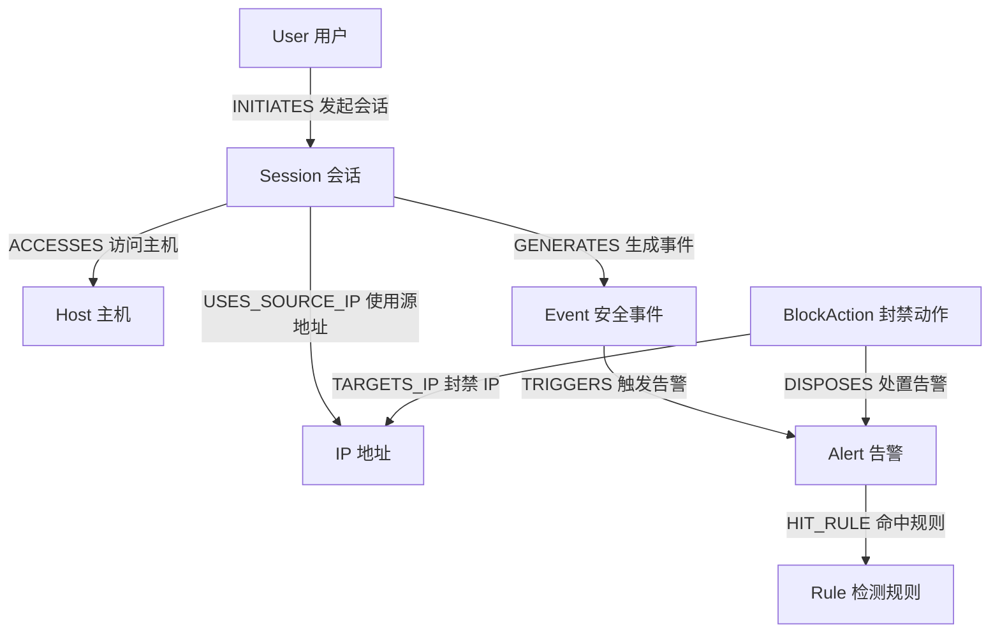

# 图模型设计

## 1. 设计目标
本项目的图模型目标不是简单存储日志，而是把“企业网络中的访问行为、异常事件、告警结果和处置动作”组织成可追踪的安全关系网络。这样做的意义在于：

1. 能够直观表达用户、主机、IP、会话之间的访问关系。
2. 能够把恶意行为识别结果回写到图谱中，形成检测闭环。
3. 能够支持后续的路径追踪、风险评分、告警展示和自动封禁。
4. 能够为论文中的“攻击链可视化”和“图谱关联分析”提供模型基础。

## 2. 建模原则
### 2.1 最小可用原则
第一阶段只保留最核心的实体和关系，优先保证模型清晰、可运行、可扩展。

### 2.2 过程可追溯原则
模型中不仅保留“谁访问了谁”，还保留“产生了什么事件、触发了什么告警、执行了什么封禁动作”。

### 2.3 易于规则检测原则
通过 `Session`、`Event`、`Alert` 三层结构，把原始日志、检测规则和处置动作解耦，方便后续扩展多种识别算法。

### 2.4 面向论文表达原则
模型设计不仅服务系统实现，也服务论文叙述，因此标签名称、关系名称和属性语义要尽量直观。

## 3. 核心图谱结构



上图体现了系统的基本闭环：
1. 用户从某个 IP 发起访问会话并访问某台主机。
2. 会话过程经过日志抽取后形成安全事件。
3. 事件触发告警并命中相应规则。
4. 告警可联动封禁动作，处置目标 IP。

## 4. 节点模型设计

| 标签 | 含义 | 关键属性 | 建模原因 |
| --- | --- | --- | --- |
| `User` | 用户账号实体 | `user_id`、`username`、`department`、`risk_score` | 描述行为主体，支持账号风险分析 |
| `Host` | 企业资产实体 | `host_id`、`hostname`、`asset_type`、`critical_level` | 描述被访问目标，支持高价值资产识别 |
| `IP` | 网络地址实体 | `ip_id`、`ip_address`、`ip_type`、`is_blocked` | 描述访问来源和封禁对象 |
| `Session` | 登录或访问会话 | `session_id`、`protocol`、`start_time`、`risk_score` | 承载访问上下文，连接主体、来源和目标 |
| `Event` | 从日志抽取出的安全事件 | `event_id`、`event_type`、`event_level`、`risk_score` | 承载识别语义，支持事件分析 |
| `Rule` | 风险识别规则 | `rule_id`、`rule_name`、`rule_category` | 表示检测规则来源 |
| `Alert` | 告警记录 | `alert_id`、`severity`、`status`、`score` | 表示检测输出结果 |
| `BlockAction` | 封禁或处置动作 | `action_id`、`action_type`、`status` | 表示联动防御和审计留痕 |

## 5. 关系模型设计

| 关系类型 | 起点 -> 终点 | 中文含义 | 说明 |
| --- | --- | --- | --- |
| `INITIATES` | `User -> Session` | 用户发起会话 | 表示谁发起了访问行为 |
| `USES_SOURCE_IP` | `Session -> IP` | 会话使用源 IP | 表示访问来源地址 |
| `ACCESSES` | `Session -> Host` | 会话访问主机 | 表示访问目标资产 |
| `GENERATES` | `Session -> Event` | 会话生成事件 | 表示该会话中产生了何种安全事件 |
| `TRIGGERS` | `Event -> Alert` | 事件触发告警 | 表示检测输出结果 |
| `HIT_RULE` | `Alert -> Rule` | 告警命中规则 | 表示该告警由哪条规则产生 |
| `DISPOSES` | `BlockAction -> Alert` | 动作处置告警 | 表示封禁动作对应的告警来源 |
| `TARGETS_IP` | `BlockAction -> IP` | 动作封禁 IP | 表示本次处置的目标对象 |

## 6. 为什么引入 Session 节点
在安全场景中，如果直接建模为 `User -> Host` 或 `IP -> Host`，会丢失大量上下文信息，例如：

1. 使用了什么协议。
2. 登录是否成功。
3. 会话持续了多久。
4. 在同一访问过程中产生了哪些事件。

因此本项目引入 `Session` 节点作为行为上下文容器，用它串联“用户、IP、主机、事件”，这样更适合表达真实攻击链。

## 7. 风险流转路径设计
本模型中的风险流转逻辑如下：

1. 原始日志经过清洗后形成 `Session` 和 `Event`。
2. `Event` 根据规则匹配结果生成 `Alert`。
3. `Alert` 根据严重程度、得分和策略决定是否触发 `BlockAction`。
4. `BlockAction` 将处置结果回写到图谱中，从而形成闭环追溯链。

这种设计既能支撑实时告警，也能支撑事后追踪和审计分析。

## 8. 典型攻击场景映射

### 8.1 暴力破解场景
图谱路径可表示为：

`IP -> Session -> Event(LOGIN_FAIL) -> Alert(暴力破解告警) -> BlockAction(封禁 IP)`

适用说明：
1. 外部地址反复尝试登录某台终端或服务器。
2. 失败次数超过阈值后触发规则。
3. 告警生成后自动封禁源 IP。

### 8.2 横向移动场景
图谱路径可表示为：

`User -> Session -> Host(高价值主机) -> Event(LATERAL_MOVE) -> Alert(横向移动告警)`

适用说明：
1. 同一账号在短时间内访问多台高价值主机。
2. 访问模式与正常运维路径不一致。
3. 告警产生后可继续联动隔离 IP 或锁定账号。

### 8.3 高频访问场景
图谱路径可表示为：

`User -> Session -> Event(HIGH_FREQ_ACCESS) -> Alert(高频访问告警)`

适用说明：
1. 短时间内请求次数异常升高。
2. 可用于发现扫描、脚本批量探测或异常自动化访问。

## 9. 便于查询的建模收益
采用当前模型后，可以方便支持以下查询需求：

1. 查询某个高风险 IP 触发过哪些事件和告警。
2. 查询某个用户近期访问过哪些关键主机。
3. 查询某条规则最近命中了多少次。
4. 查询某个封禁动作来自哪条告警、哪次事件、哪个会话。

## 10. 样例查询思路

### 10.1 查询被封禁的高风险 IP
```cypher
MATCH (b:BlockAction)-[:TARGETS_IP]->(ip:IP)
RETURN b.action_id, ip.ip_address, ip.risk_score, b.executed_at
ORDER BY b.executed_at DESC;
```

### 10.2 查询横向移动相关链路
```cypher
MATCH (u:User)-[:INITIATES]->(s:Session)-[:GENERATES]->(e:Event {event_type: 'LATERAL_MOVE'})-[:TRIGGERS]->(a:Alert)
MATCH (s)-[:ACCESSES]->(h:Host)
RETURN u.username, s.session_id, h.hostname, a.alert_name, a.severity;
```

### 10.3 查询某条规则产生的告警
```cypher
MATCH (a:Alert)-[:HIT_RULE]->(r:Rule {rule_id: 'R001'})
RETURN a.alert_id, a.alert_name, a.status, a.score;
```

## 11. 可扩展方向
当前模型为第一阶段最小可用模型，后续可以平滑扩展以下对象：

1. `Department` 节点：支持组织结构分析。
2. `File` 节点：支持敏感文件访问追踪。
3. `Process` 节点：支持主机侧进程行为建模。
4. `Policy` 节点：支持封禁策略、白名单和审批链。
5. `AuditLog` 节点：支持更细粒度的审计留痕。

## 12. 论文写作可用描述
可在论文中将本节概括为：

“系统采用以会话为中心的安全行为图模型，将用户、主机、IP 等基础实体与事件、告警、封禁动作等过程实体统一映射到 Neo4j 图数据库中，通过显式关系保留攻击链上下文，从而提升恶意行为识别、路径追踪和处置审计的可解释性。”
